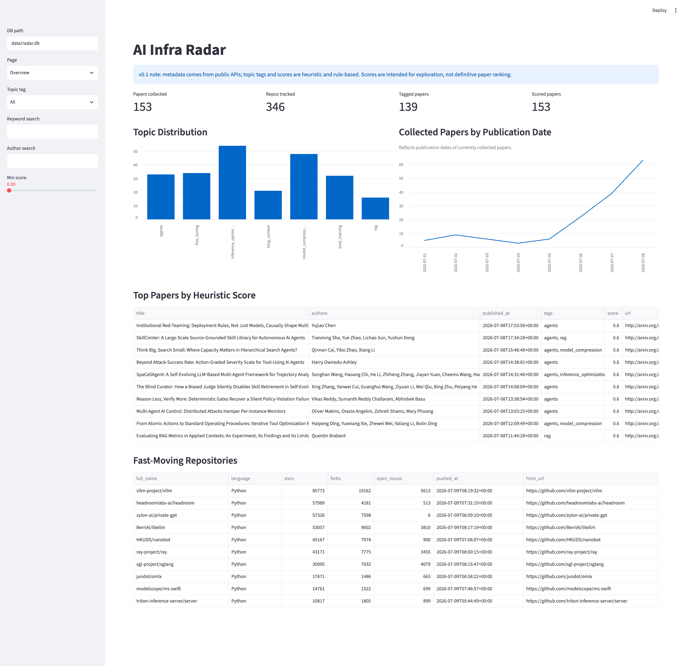

# AI Infra Radar

Track which AI research ideas are turning into real code.

AI Infra Radar is a local-first dashboard for AI infrastructure trends across arXiv and GitHub. It collects public metadata, stores it in SQLite, applies rule-based topic tags, computes exploratory scores, generates Markdown digests, and renders a Streamlit dashboard.



## Why This Exists

AI infrastructure ideas move quickly from papers to repositories. AI Infra Radar helps researchers, engineers, and open-source maintainers see which topics are gaining implementation traction without relying on paid APIs, private datasets, or fragile scraping.

## Features

- arXiv Atom feed ingestion.
- GitHub repository search ingestion.
- Local SQLite persistence with idempotent upserts.
- Rule-based topic tagging for public v0.1 taxonomy.
- Paper-level heuristic scoring.
- Daily Markdown digest generation.
- Streamlit dashboard for papers, repos, topic trends, and digests.

## Architecture

```text
config.example.yaml
  -> collectors
  -> SQLite
  -> tagging
  -> scoring
  -> Markdown digest
  -> Streamlit dashboard
```

## Quick Start

```bash
python3.11 -m venv .venv
source .venv/bin/activate
python -m pip install -e ".[dev]"
```

## GitHub Token

Set a GitHub token for better GitHub Search API coverage:

```bash
export GITHUB_TOKEN="..."
```

Without a token, the GitHub Search API may return partial results due to rate limits.

## Run the Pipeline

```bash
python -m radar.cli ingest-arxiv --config config.example.yaml --db data/radar.db
python -m radar.cli ingest-github --config config.example.yaml --db data/radar.db
python -m radar.cli tag-papers --config config.example.yaml --db data/radar.db
python -m radar.cli score --config config.example.yaml --db data/radar.db
python -m radar.cli digest --config config.example.yaml --db data/radar.db --date today
```


## Launch Dashboard

```bash
streamlit run app/streamlit_app.py
```

The dashboard defaults to `data/radar.db` and shows setup commands if the database does not exist.

## Reliability Note

arXiv and GitHub metadata comes from public APIs. Topic tags and scores are rule-based heuristics in v0.1. Ranking is for exploration, not definitive research evaluation. GitHub results may be partial if rate limited.

## Roadmap

- Paper-to-repo matching.
- Repo star growth snapshots.
- Hugging Face model tracking.
- Anomaly detection.
- GitHub Actions daily run.
- Sample mode.

## Contributing

Contributions are welcome. Keep changes local-first, deterministic where possible, and covered by focused tests. Run the checks before opening a PR:

```bash
python -m pytest
ruff check .
```
